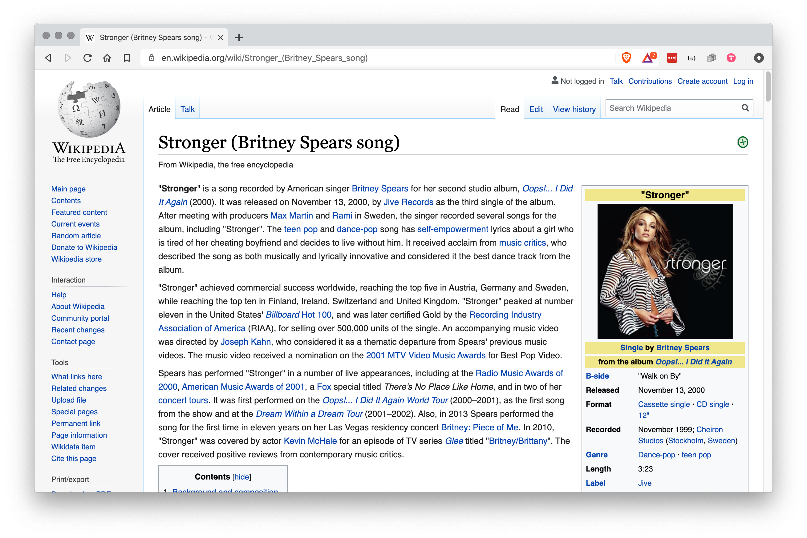

# stronk

This Chrome extension makes webpages stronker.

## Before

## After

## Installation

1. Clone this repository
1. Open the Extension Management page by navigating to `chrome://extensions`
1. Enable Developer Mode by clicking the toggle switch next to Developer mode
1. Click the Load Unpacked button and select the repository folder
1. Reload Chrome
